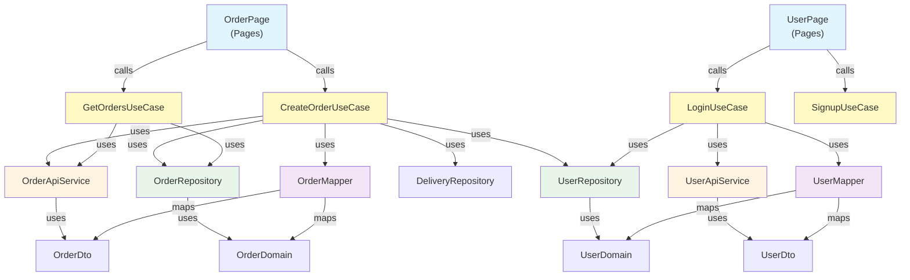

# 아키텍처 개선안

## 현재 구조의 문제점

### 1. 레이어 간 의존성 문제

- **Pages가 너무 많은 책임**: Controller 역할과 함께 비즈니스 로직, Storage 직접 접근, Domain 모델 직접 사용
- **Service와 Repository 혼재**: Pages에서 Service와 Storage를 동시에 사용하여 책임이 모호함
- **Domain과 DTO 혼용**: Pages에서 Domain 모델을 직접 사용하는 동시에 DTO도 사용

### 2. 의존성 방향 문제

```
현재: Pages → Service + Storage + Domain + DTO (모두 직접 접근)
문제: Pages가 너무 많은 레이어에 의존
```

### 3. 매핑 로직 분산

- Domain ↔ DTO 변환이 Service와 Pages 양쪽에 분산되어 있음
- 예: `purchase/page.tsx`에서 OrderItem → OrderRequest 변환 로직이 Page에 있음

## 개선안

### 개선안 1: Service Layer를 통한 통합 접근

```
Pages → Service → Repository + API Service
         ↓
      DTO ↔ Domain 매핑
```

**변경사항:**

- Pages는 Service만 의존
- Service가 Repository와 API Service를 모두 관리
- Domain과 DTO 변환은 Service에서만 수행

**장점:**

- 단일 진입점 제공
- 비즈니스 로직 중앙화
- 테스트 용이성 향상

**단점:**

- Service가 비대해질 수 있음

### 개선안 2: UseCase 패턴 도입 (추천)

```
Pages → UseCase → Service/Repository → Domain
         ↓           ↓
      DTO        DTO
```

**구조:**

```
src/
  app/                    # Pages (Controller)
  usecases/
    order/
      CreateOrderUseCase.ts
      GetOrdersUseCase.ts
      UpdateOrderUseCase.ts
    user/
      LoginUseCase.ts
      SignupUseCase.ts
  services/               # API Service
    order.ts
    user.ts
  repositories/           # Storage Repository
    orderRepository.ts
    userRepository.ts
  domain/                 # Domain Models
    order/
    user/
  dto/                    # DTOs
    order/
    user/
```

**UseCase 예시:**

```typescript
// usecases/order/CreateOrderUseCase.ts
export class CreateOrderUseCase {
  constructor(
    private orderApi: OrderApiService,
    private orderRepo: OrderRepository,
    private deliveryRepo: DeliveryRepository,
    private userRepo: UserRepository
  ) {}

  async execute(): Promise<OrderResponse> {
    // 1. Domain 모델 조회
    const orders = this.orderRepo.getOrders();
    const deliveryInfo = this.deliveryRepo.getDeliveryInfo();
    const userInfo = this.userRepo.getUserInfo();

    // 2. Domain → DTO 변환
    const orderRequest = this.mapToOrderRequest(orders, deliveryInfo, userInfo);

    // 3. API 호출
    const response = await this.orderApi.createOrder(orderRequest);

    // 4. 응답을 Domain 모델로 변환 후 저장
    const orderHistory = this.mapToOrderHistory(response);
    this.orderHistoryRepo.addOrderHistory(orderHistory);

    return response;
  }

  private mapToOrderRequest(...): OrderRequest { ... }
  private mapToOrderHistory(...): OrderHistory { ... }
}
```

**장점:**

- 각 UseCase가 하나의 비즈니스 로직만 담당
- 테스트하기 쉬움 (UseCase 단위 테스트)
- Pages는 단순해짐
- 확장성 좋음

### 개선안 3: 현재 구조 유지 + 경량 개선

현재 구조를 유지하면서 다음만 개선:

1. **Mapper 레이어 추가**

```typescript
// mappers/orderMapper.ts
export class OrderMapper {
  static toOrderRequest(
    orders: OrderItem[],
    deliveryInfo: DeliveryInfo,
    userInfo: UserInfo
  ): OrderRequest {
    // 변환 로직
  }

  static toOrderDomain(response: OrderResponse): OrderHistory {
    // 변환 로직
  }
}
```

2. **Pages에서 비즈니스 로직 분리**

   - 계산 로직을 Utils로 이동
   - 매핑 로직을 Mapper로 이동

3. **의존성 명확화**
   - Pages → Service (API 호출용)
   - Pages → Repository (로컬 저장용, 임시 데이터만)
   - Service → Repository (필요시)

## 추천 개선안: 개선안 2 (UseCase 패턴)

### 이유

1. **확장성**: 새로운 기능 추가 시 UseCase만 추가하면 됨
2. **테스트 용이성**: UseCase 단위로 테스트 가능
3. **명확한 책임 분리**: 각 레이어의 역할이 명확
4. **유지보수성**: 비즈니스 로직 변경 시 해당 UseCase만 수정

### 마이그레이션 단계

1. **1단계: Repository 패턴 정리**

   - `storage/` → `repositories/`로 이동
   - Interface 정의

2. **2단계: Mapper 도입**

   - Domain ↔ DTO 변환 로직 분리

3. **3단계: UseCase 생성**

   - 주요 비즈니스 로직부터 순차적으로 UseCase로 이동

4. **4단계: Pages 리팩토링**
   - Pages는 UseCase만 호출하도록 변경

## 개선된 아키텍처 다이어그램


