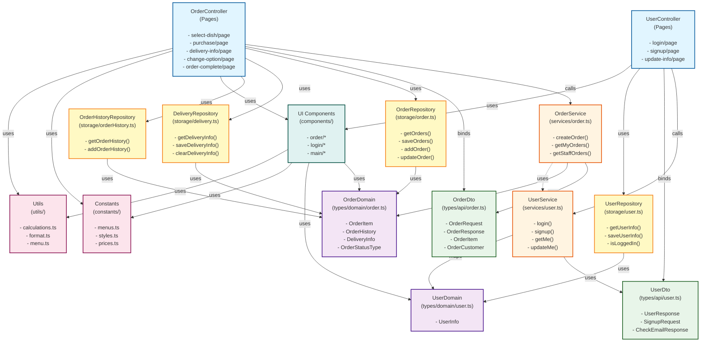

# 컴포넌트 패키지 구성 다이어그램

## 📊 다이어그램 보는 방법

### 방법 1: 온라인 뷰어 (가장 빠름)

1. [Mermaid Live Editor](https://mermaid.live/) 접속
2. 아래 Mermaid 코드를 복사해서 붙여넣기
3. 자동으로 그래프로 렌더링됩니다

### 방법 2: VS Code / Cursor 확장 프로그램

1. "Markdown Preview Mermaid Support" 확장 프로그램 설치
2. VS Code에서 `Cmd+Shift+V` (Mac) 또는 `Ctrl+Shift+V` (Windows)로 미리보기
3. 또는 Markdown 파일에서 우클릭 → "Open Preview"

### 방법 3: GitHub/GitLab

- 파일을 GitHub/GitLab에 올리면 자동으로 렌더링됩니다

### 방법 4: 온라인 뷰어 링크 (복사해서 접속)

```
https://mermaid.live/edit#pako:eNqVUktuwjAQ_BUrO1uJbcqlQqWXcmiR0FtXsQGLtF7WSUoq8e-VE3pBoF54WO-_2ZnZHQ3gOCAQC3S0hQBHCgKHSERKSA1aSs1N8uSZFB4OBwGqQWpqXlEQwNG9G4xEJLRXyC8NxHL1nGQv-y8ZxQHx5YmWxZXWIyGzLBOCuZv2Y0fKgXx0bqRFJqU7fSQbPCQZgGf_NW7OzCQbDRK3nCxnm5tB4r0cb7V-qCZh1tUZOAqVEpPybN1ZXcK-kpB2YzAhKzVHBpU6gQEAC1EBDaJWjFJrBCsJGdEeCzWnEaUL4xZRs1LQrFV3w1Y3pF_BVpfw1aUeYfZXE6tL_V2X4UwX
```

---

## 현재 프로젝트 구조

> 💡 **팁**: 아래 코드를 [Mermaid Live Editor](https://mermaid.live/)에 붙여넣으면 그래프로 볼 수 있습니다.
>
> **복사 방법**: ` ```mermaid`와 ` ``` `는 **제외**하고, 그 안의 내용만 복사하세요!
> 예: `graph TB`부터 시작해서 마지막 `style Utils...`까지만 복사

```mermaid
graph TB
    %% Order Domain
    subgraph "Order Pages (Controller)"
        OrderPage[OrderPage<br/>select-dish, purchase, etc.]
    end

    subgraph "Order Service"
        OrderService[OrderApiService<br/>orderApi]
    end

    subgraph "Order DTO"
        OrderDto[OrderDto<br/>types/api/order.ts]
    end

    subgraph "Order Domain"
        OrderDomain[OrderDomain<br/>types/domain/order.ts]
    end

    subgraph "Order Storage (Repository)"
        OrderStorage[orderStorage<br/>storage/order.ts]
        DeliveryStorage[deliveryStorage<br/>storage/delivery.ts]
        OrderHistoryStorage[orderHistoryStorage<br/>storage/orderHistory.ts]
    end

    %% User Domain
    subgraph "User Pages (Controller)"
        UserPage[UserPage<br/>login, signup, update-info]
    end

    subgraph "User Service"
        UserService[UserApiService<br/>userApi]
    end

    subgraph "User DTO"
        UserDto[UserDto<br/>types/api/user.ts]
    end

    subgraph "User Domain"
        UserDomain[UserDomain<br/>types/domain/user.ts]
    end

    subgraph "User Storage (Repository)"
        UserStorage[userStorage<br/>storage/user.ts]
    end

    %% Shared Components
    subgraph "UI Components"
        Components[Components<br/>order/*, login/*, main/*]
    end

    subgraph "Constants"
        Constants[Constants<br/>menus.ts, styles.ts, prices.ts]
    end

    subgraph "Utils"
        Utils[Utils<br/>calculations.ts, format.ts, menu.ts]
    end

    %% Order Domain Relationships
    OrderPage -->|calls| OrderService
    OrderPage -->|binds| OrderDto
    OrderPage -->|uses| OrderStorage
    OrderPage -->|uses| DeliveryStorage
    OrderPage -->|uses| OrderHistoryStorage
    OrderPage -->|uses| Components
    OrderPage -->|uses| Constants
    OrderPage -->|uses| Utils

    OrderService -->|uses| OrderDto
    OrderService -->|maps| OrderDomain

    OrderStorage -->|uses| OrderDomain
    DeliveryStorage -->|uses| OrderDomain
    OrderHistoryStorage -->|uses| OrderDomain

    Components -->|uses| OrderDomain
    Components -->|uses| UserDomain
    Components -->|uses| Constants
    Components -->|uses| Utils

    %% User Domain Relationships
    UserPage -->|calls| UserService
    UserPage -->|binds| UserDto
    UserPage -->|uses| UserStorage
    UserPage -->|uses| Components

    UserService -->|uses| UserDto
    UserService -->|maps| UserDomain

    UserStorage -->|uses| UserDomain

    %% Cross-domain relationships
    OrderService -.->|uses| UserService
    OrderPage -.->|uses| UserStorage

    style OrderPage fill:#e1f5ff
    style UserPage fill:#e1f5ff
    style OrderService fill:#fff4e1
    style UserService fill:#fff4e1
    style OrderDto fill:#e8f5e9
    style UserDto fill:#e8f5e9
    style OrderDomain fill:#f3e5f5
    style UserDomain fill:#f3e5f5
    style OrderStorage fill:#fff9c4
    style UserStorage fill:#fff9c4
    style DeliveryStorage fill:#fff9c4
    style OrderHistoryStorage fill:#fff9c4
    style Components fill:#e0f2f1
    style Constants fill:#fce4ec
    style Utils fill:#fce4ec
```

## 상세 컴포넌트 다이어그램 (그림 형식)


